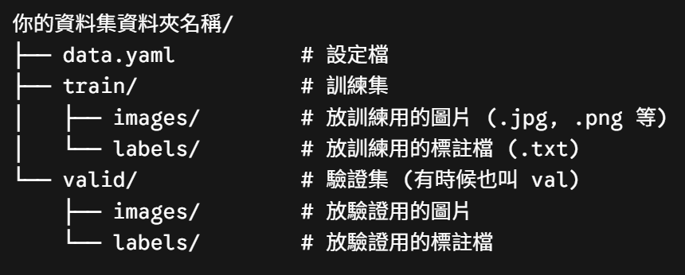
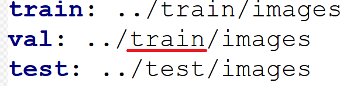

## Yolo 資料夾結構
<table>
  <tr>
    <td align="center">
      
    </td>
  </tr>
</table>
* 這是Yolo規定的資料夾結構

## 設定 val 
* 標註完成後的資料集，只有`train資料`   但沒有`Valid資料`，訓練模型也需要 `Valid資料`否則會報錯，可以直接複製 `train資料`當成 `valid資料`，或者直接在 `data.tmal` 內設定共用資料 
<table>
  <tr>
    <td align="center">
      
    </td>
  </tr>
</table>

## 標註工具

* 標註工具有很多種，也包括線上或離線的標註工具
* 我為方便，選用 線上工具 `RoboFlow`:
`https://app.roboflow.com/`